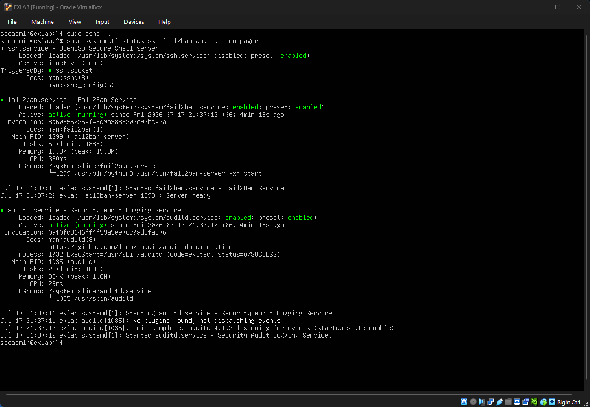
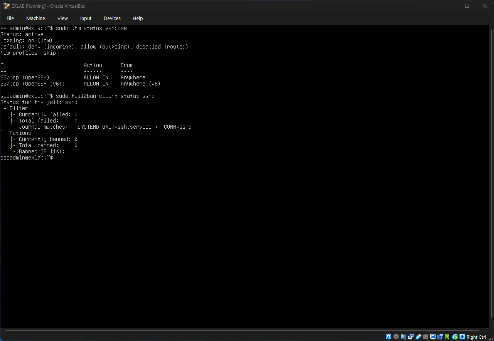
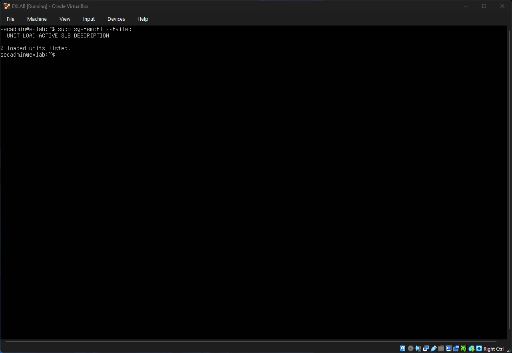
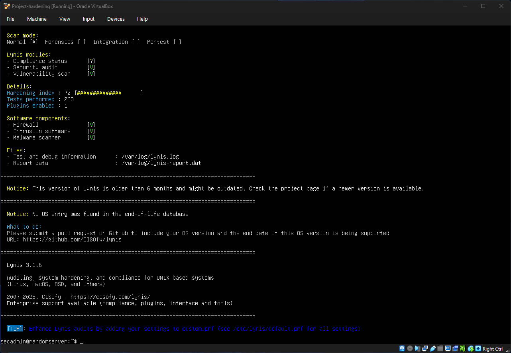

# 11 — Validation and Security Checklist

Use this checklist to verify system state after your initial implementation, and as a regression check after any major package upgrades or configuration modifications.

## Access & Identity

* [x] **Non-root sudo user exists:** Administrative tasks are delegated to the `secadmin` account.


* [x] **Root SSH login disabled:** `PermitRootLogin no` is actively enforced in the configuration.


* [x] **Password SSH auth disabled:** `PasswordAuthentication no` prevents all credential-guessing attempts.


* [x] **SSH key-based auth validated:** Public asymmetric keys are mapped and tested securely.


* [x] **Sudo privileges reviewed:** Confirmed strict privilege bounds using `sudo -l -U secadmin`.


## SSH

* [x] **Configuration syntax validated:** `sudo sshd -t` returns no errors or invalid directives.


* [x] **User containment configured:** `AllowUsers secadmin` strictly limits authentication entry points.


* [x] **Authentication limits enforced:** `MaxAuthTries 3` limits connection exploitation windows.


* [x] **Idle timeouts configured:** `ClientAliveInterval 300` ensures silent dead sessions drop.


* [x] **Lockout safety verification:** A second terminal session was tested and passed before terminating the active session.


## Firewall / Network

* [x] **Default deny incoming enabled:** `ufw default deny incoming` cuts off arbitrary external probes.


* [x] **Only required ports open:** Perimeter narrowed down specifically to standard administrative infrastructure.


* [x] **SSH source restricted:** Implemented explicit network rule tracking for management workstations.


* [x] **Firewall state verified:** Outward exposure audited and validated via `sudo ufw status verbose`.


* [x] **Sockets verified:** Evaluated system state using `ss -tulpen` to track hidden background listeners.


## Patching

* [x] **System fully updated:** Core dependencies and application binaries refreshed via `apt full-upgrade`.


* [x] **Unattended upgrades enabled:** Automatic background processing configured in `20auto-upgrades`.


* [x] **Regular patch schedule documented:** Established a distinct weekly/monthly maintenance cadence.


## Intrusion Prevention

* [x] **Fail2ban active:** Intrusion management daemon installed and verified running.


* [x] **SSH jail enabled:** Systemd-backend tracking active under `/etc/fail2ban/jail.local`.


* [x] **Ban policy reviewed:** Implemented a practical `bantime = 1h` with a strict `maxretry = 5` threshold.


## Kernel/Runtime

* [x] **Sysctl configurations loaded:** Low-level network rules populated into `/etc/sysctl.d/99-hardening.conf`.


* [x] **Anti-spoofing active:** Reverse Path Filtering (`rp_filter`) enabled globally.


* [x] **Routing redirections blocked:** ICMP redirections disabled to stop Man-in-the-Middle (MitM) vectors.


* [x] **Unused components audited:** Unnecessary background unit dependencies audited and cleaned up.


## Logging/Auditing

* [x] **Visibility frameworks running:** Log data accessible via native `journalctl` utility sets.


* [x] **Audit daemon running:** Low-level subsystem audit collection engine (`auditd`) online and listening.


* [x] **Malware/Rootkit baselining complete:** Initial definitions properties tracking configured using `rkhunter --propupd`.

## Backup/Recovery

* [x] **Config backup created:** Archived core rules using `tar czf` to a compressed root snapshot file.
* [x] **Off-server copy stored securely:** Changed ownership with `chown secadmin:secadmin` to cleanly execute an off-host `scp` transfer.
* [x] **Restore procedure documented:** Rollback strategies recorded to cleanly restore original configurations if an upgrade goes sideways.


---

## Validation Proof

```bash
# Validate SSH configuration syntax
sudo sshd -t

# Check the active status of core defensive daemons
sudo systemctl status ssh fail2ban auditd --no-pager
```


```bash
# Review network perimeter rules
sudo ufw status verbose

# Inspect active Fail2Ban jail metrics
sudo fail2ban-client status sshd
```


```bash
# Ensure no systemd services failed to initialize
sudo systemctl --failed

```


```bash
# Verify hardening with scanners Lynis
sudo lynis audit system
```
After trying second time I managed Hardening Index 72


